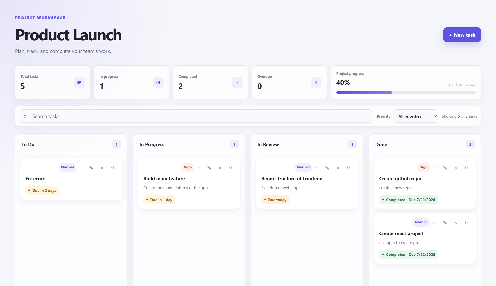
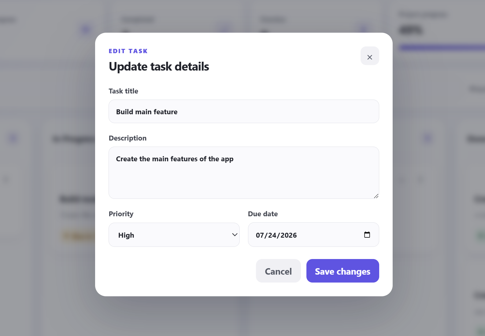
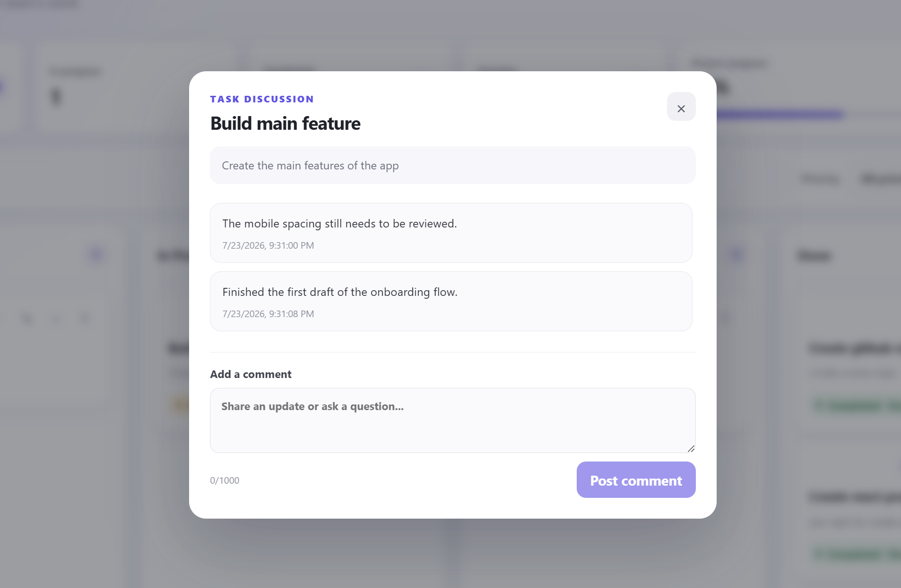

# Kanban Task Board

A polished, full-stack Kanban task management application built with React, TypeScript, Supabase, and Vercel.

Users are automatically signed in through a private anonymous guest session. Each guest can create, edit, move, comment on, search, filter, and delete their own tasks while Supabase Row Level Security keeps every user's data isolated.

## Live Demo

[Open the live application](https://kanban-task-board-drab-nine.vercel.app/)

## Repository

Replace the link below with your public GitHub repository URL:

[View the source code](https://github.com/mysticCryptic/kanban-task-board.git)

## Preview



## Features

### Core functionality

- Four-column Kanban workflow:
  - To Do
  - In Progress
  - In Review
  - Done
- Create tasks with a title, description, priority, and optional due date
- Drag and drop tasks between columns
- Edit existing tasks
- Delete tasks with confirmation
- Persistent task data stored in Supabase
- Automatic anonymous guest authentication
- Row Level Security that isolates each guest's data
- Responsive layout for desktop and smaller screens
- Loading, empty, and error states

### Advanced functionality

- Search tasks by title or description
- Filter tasks by priority
- Due-date indicators for overdue, due-today, and due-soon tasks
- Board statistics for total, active, completed, and overdue tasks
- Completion progress bar
- Task comments stored in a separate Supabase table
- Chronological comment history with timestamps
- Optimistic drag-and-drop updates with rollback on failure

## Screenshots

### Board overview


### Task creation and editing



### Task comments



## Technology Stack

- **Frontend:** React, TypeScript, Vite
- **Drag and drop:** dnd-kit
- **Database:** Supabase PostgreSQL
- **Authentication:** Supabase anonymous authentication
- **Security:** PostgreSQL Row Level Security
- **Hosting:** Vercel
- **Version control:** Git and GitHub

## Database Structure

### `tasks`

| Column | Type | Description |
|---|---|---|
| `id` | `uuid` | Primary key |
| `title` | `text` | Required task title |
| `description` | `text` | Optional task details |
| `status` | `text` | `todo`, `in_progress`, `in_review`, or `done` |
| `priority` | `text` | `low`, `normal`, or `high` |
| `due_date` | `date` | Optional task deadline |
| `user_id` | `uuid` | Anonymous authenticated owner |
| `created_at` | `timestamptz` | Automatic creation timestamp |

### `comments`

| Column | Type | Description |
|---|---|---|
| `id` | `uuid` | Primary key |
| `task_id` | `uuid` | Associated task |
| `user_id` | `uuid` | Anonymous authenticated owner |
| `body` | `text` | Comment content |
| `created_at` | `timestamptz` | Automatic creation timestamp |

Both tables use Row Level Security. Users can only read and modify records tied to their own authenticated guest account.

## Running Locally

### Prerequisites

- Node.js
- npm
- A free Supabase project

### Installation

Clone the repository:

```bash
git clone https://github.com/mysticCryptic/kanban-task-board.git
cd kanban-task-board
```

Install dependencies:

```bash
npm install
```

Create a `.env.local` file in the project root:

```env
VITE_SUPABASE_URL=your_supabase_project_url
VITE_SUPABASE_ANON_KEY=your_supabase_publishable_key
```

Do not use or expose the Supabase service-role key.

Start the development server:

```bash
npm run dev
```

Open the local URL shown by Vite, typically:

```text
http://localhost:5173
```

## Available Scripts

Run the development server:

```bash
npm run dev
```

Check the code with ESLint:

```bash
npm run lint
```

Create a production build:

```bash
npm run build
```

Preview the production build locally:

```bash
npm run preview
```

## Security

- Anonymous users receive unique authenticated Supabase sessions.
- Tasks and comments are tied to the current user's UUID.
- Row Level Security prevents users from accessing another guest's records.
- Only the public Supabase publishable key is used by the frontend.
- Environment files are excluded from Git.
- The Supabase service-role key is never committed or exposed.

## Design Decisions

The interface was designed to feel closer to a modern project-management tool than a basic todo list. It uses a clear visual hierarchy, compact task cards, distinct priority and deadline indicators, responsive board columns, and immediate feedback during database operations.

The frontend communicates directly with Supabase instead of using a custom backend API. This reduced complexity while still providing authentication, persistence, relational data, and database-enforced security.

## Tradeoffs and Future Improvements

Given more time, the project could include:

- Custom labels and tag filtering
- Team members and task assignees
- Activity history for task changes
- Reordering tasks within the same column
- Realtime synchronization across browser tabs
- Custom confirmation and toast components
- Comment editing and deletion
- Automated tests
- User-controlled board names and multiple boards

## Deployment

The application is deployed on Vercel:

[https://kanban-task-board-drab-nine.vercel.app/](https://kanban-task-board-drab-nine.vercel.app/)

Vercel automatically builds and deploys new commits from the connected GitHub repository.
